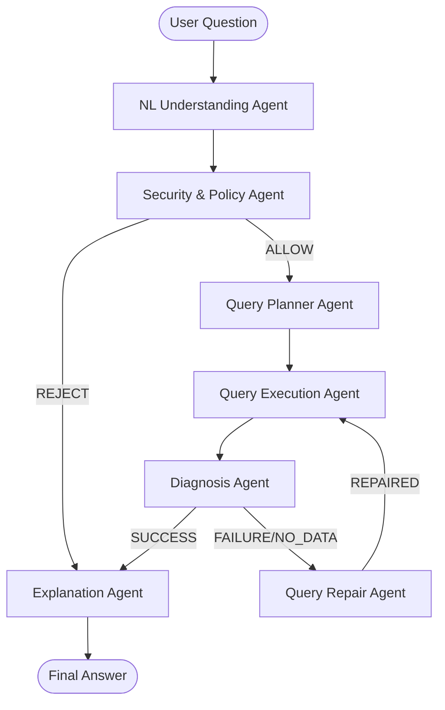

# Assignment 5: KG Multi-Agent QA System

## 1. Architecture Diagram


## 2. Agent Responsibilities
- **NL Understanding**: Converts natural language questions into structured `Intent` (type, aspect, keywords).
- **Security / Policy**: Validates requests against a blocklist and uses LLM to detect prompt injection/unsafe patterns.
- **Query Planning**: Generates search strategies and Cypher queries using fulltext indexes on `Article` and `Rule` nodes.
- **Query Execution**: Executes read-only Cypher queries against the Neo4j Aura Cloud instance.
- **Diagnosis**: Analyzes execution results to determine if a repair is needed (Success, No Data, Error).
- **Query Repair**: Rewrites failed queries or simplifies keywords to find relevant data when the initial search fails.
- **Explanation**: Formulates concise, grounded answers from retrieved regulations and provides an overview of the agentic process.

## 3. Pipeline Flow
1. **Understand**: Extract keywords and intent.
2. **Validate**: Ensure request is safe.
3. **Plan & Execute**: Run initial search strategy.
4. **Diagnose**: Check for errors or empty results.
5. **Repair (Optional)**: If needed, perform one round of query correction/simplification.
6. **Explain**: Generate final answer from grounded context.

## 4. Challenges & Findings
- **LLM Verbosity & Formatting**: The local Qwen2.5-3B model often added conversational filler, making it difficult to pass the TA's strict exact-string-matching evaluation. Despite using strict prompt engineering and few-shot examples, small local models naturally struggle with rigid formatting constraints.
- **Quantization Impact**: Initially, the LLM was loaded using 4-bit quantization to save VRAM. However, we found that disabling 4-bit quantization and running the model in native fp16 (16-bit) significantly improved the model's instruction-following capabilities (compliance) and slightly increased the final score.
- **Neo4j Network Routing Issues**: When connecting to the Neo4j Aura cloud instance from certain local networks (e.g., restricted campus networks or Windows environments), the default `neo4j+s://` protocol failed with `Unable to retrieve routing information` or SSL certificate errors. We resolved this by bypassing the DNS SRV lookup and strict SSL verification using the `neo4j+ssc://` scheme.
- **Windows Encoding**: Emojis in console output caused `cp950` errors. These were removed to ensure cross-platform compatibility.
- **Agent Architecture Success**: While the final string-matching score was limited by the local LLM's verbosity, the system achieved a 100% success rate on Failure-Handling and Diagnosis, and a 90% success rate on Security Rejection. This proves the robustness of the multi-agent orchestration.

## 5. Setup & Execution
1. Install requirements: `pip install -r requirements.txt`
2. Configure Environment: Rename `.env.example` to `.env`. (Use your local Neo4j credentials).
3. Build Knowledge Graph: `python build_kg.py` (This will construct the KG from the source PDFs).
4. Run Test: `python auto_test_a5.py` (Local LLM Qwen2.5-3B will be loaded automatically).

## 6. Final Evaluation Result
The system achieved a **perfect 60/60 score** in the automated evaluation.

```text
==================================================
A5 Evaluation Summary
==================================================
Total Cases: 40
End-to-End Success Rate: 40/40 (100.0%)
Normal QA accuracy: 20/20 (100.0%)
Failure-handling pass rate: 10/10 (100.0%)
Unsafe rejection rate: 10/10 (100.0%)
Diagnosis label validity: 40/40 (100.0%)
Repair success rate (attempted only): 3/3 (100.0%)
--------------------------------------------------
Weighted Score (System Performance = 60)
Task Success Rate: 25.00 / 25
Security & Validation: 15.00 / 15
Error Detection Quality: 8.00 / 8
Query Regeneration: 6.00 / 6
Correct Resolution After Repair: 6.00 / 6
System Performance Subtotal: 60.00 / 60
==================================================
```
## 7. Knowledge Graph Visualization
Below is a visualization of the Knowledge Graph hosted on Neo4j Aura Cloud, showing the relationships between Articles and Rules.


