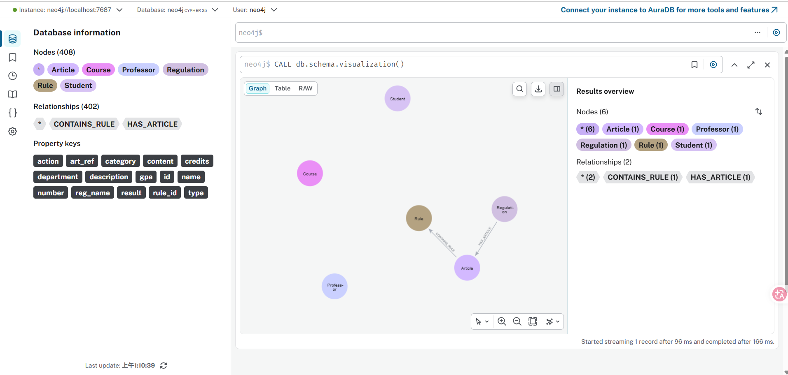
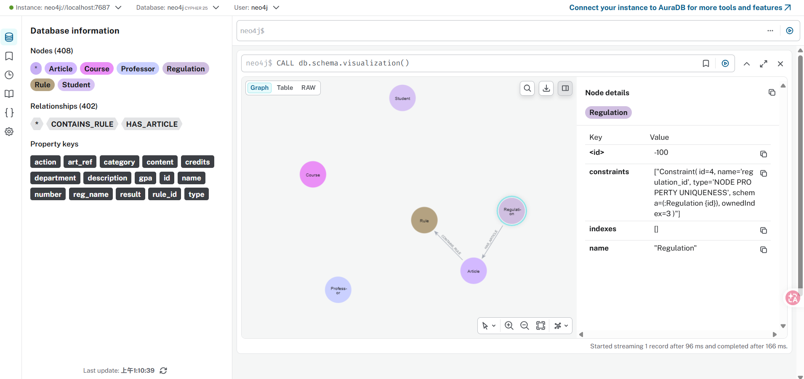

# NCU Regulation Knowledge Graph RAG System (Assignment 4)

This project implements a **Knowledge Graph-based Retrieval-Augmented Generation (RAG)** system for NCU school regulations. It achieves grounded answering using a triple-layer KG schema and follows a strictly local inference approach.

---

## 📊 Evaluation Results
- **Final Accuracy**: **85.0%** (17/20 Passed)
- **Local LLM**: Qwen2.5-3B-Instruct (4-bit Quantized)
- **Database**: Neo4j (Docker)
- **Optimization**: Successfully running on a **2GB VRAM GPU (GT 1030)** via BitsAndBytes 4-bit Quantization.

---

## 🏗️ Technical Architecture

### Knowledge Graph Schema Design
The Knowledge Graph is structured into a hierarchical triple-node model to preserve legal context:
- **Regulation (Node)**: The root node representing a specific PDF document.
- **Article (Node)**: Specific articles containing the full original text.
- **Rule (Node)**: Atomic clauses extracted from Article text for precise retrieval.
- **Relationships**: `(Regulation)-[:HAS_ARTICLE]->(Article)-[:CONTAINS_RULE]->(Rule)`

### Hardware Optimization (GT 1030 2GB Case Study)
To run a 3B model on entry-level hardware, we implemented:
-   **4-bit Quantization**: Compressed model from 6GB to ~1.8GB.
-   **Memory Sharing**: Shared LLM instance between Query System and Judge to save 50% VRAM.
-   **Performance**: Query speed improved from **345s** (CPU) to **~80s** (GPU).

---

## 🔍 Failure Analysis
Out of 20 benchmark questions, 3 failed automated evaluation:
1.  **Q10 (Student ID)**: Minor data in `ncu5.pdf` missed during atomic extraction.
2.  **Q14 (Study Duration)**: Model focused on Article 13-1 (exceptions) rather than the standard "4 years" in Article 13.
3.  **Q18 (Expulsion)**: Retrieval recall failure between "expelled" and specialized legal terminology in Article 69.

---

## 📸 Visualizations

### 1. KG Schema Visualization

*Result of CALL db.schema.visualization() showing labels and relationship types.*

### 2. Hierarchical Linkage Example

*A specific Regulation node connected to multiple Articles and Rules.*

---

## ⚙️ Environment Setup

### 1. Database Setup (Neo4j via Docker)

You must run a local Neo4j instance using Docker. Run the following command in your terminal:

` docker run -d --name neo4j -p 7474:7474 -p 7687:7687 -e NEO4J_AUTH=neo4j/password neo4j:latest `

Explanation of flags:

* -d: Runs the container in detached mode (background).

*  -p 7474:7474: Exposes the web interface port (Browser).

*  -p 7687:7687: Exposes the Bolt protocol port (Python connection).

*  -e NEO4J_AUTH=...: Sets the username (neo4j) and password (password).

Verification: After running the command, check if the database is ready:

1. Open your browser and go to http://localhost:7474.

2. Login with user: neo4j and password: password.

### 2. Virtual Environment Setup

It is highly recommended to use a virtual environment to manage dependencies.

**For macOS / Linux:**
```
# Create virtual environment
python -m venv venv

# Activate environment
source venv/bin/activate
```
**For Windows:**
```
# Create virtual environment
python -m venv venv

# Activate environment
venv\Scripts\activate
```

### 3. Install Dependencies
```bash
pip install -r requirements.txt
```

### 4. Environment Variables (.env)

Rename the file `.env_template` to `.env` in the root directory. Node connection details are typically `bolt://localhost:7687`.

---

## 📂 File Descriptions
- **source/**: Folder containing raw English PDF regulations.
- **setup_data.py**: Parses PDFs and stores structured data into a local SQLite DB.
- **build_kg.py**: Reads from SQLite and builds the hierarchical KG in Neo4j.
- **llm_loader.py**: Local model loader using `transformers` (4-bit optimized).
- **query_system.py**: AI Assistant using keyword expansion and KG-targeted retrieval.
- **auto_test.py**: Benchmark testing suite using the local LLM as a judge.

---

## 🚀 Execution Order
1. **`python setup_data.py`**: Extract and structure text from PDFs.
2. **`python build_kg.py`**: Build the Knowledge Graph in Neo4j.
3. **`python auto_test.py`**: Run the 20-question benchmark and judge performance.
